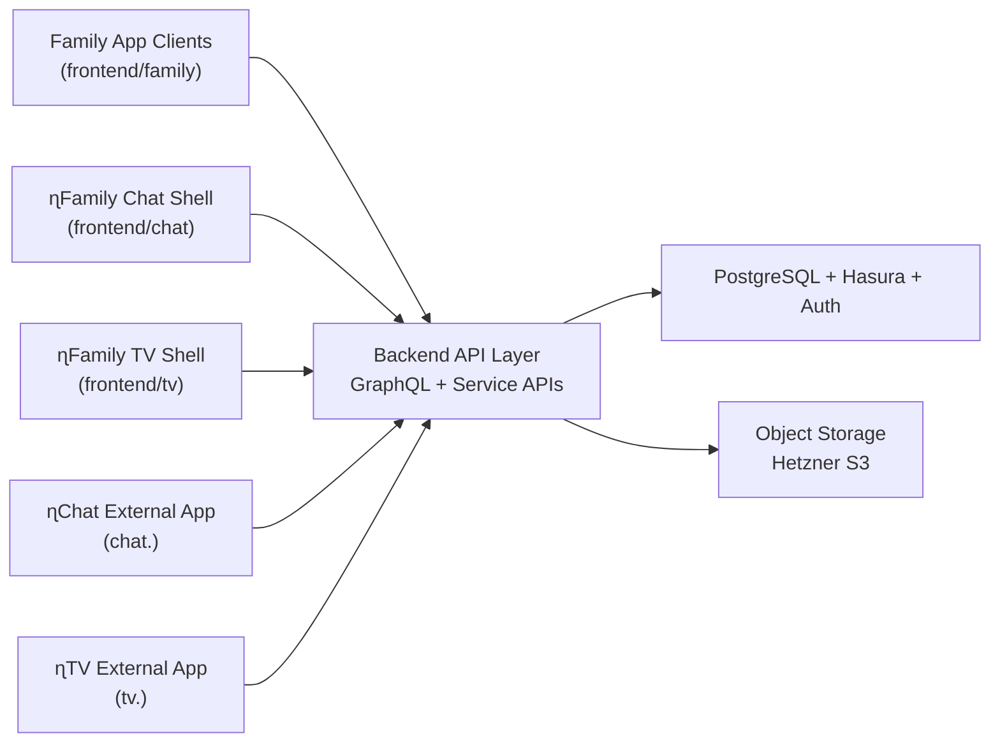

# 03 - Architecture Reference

## Logical Architecture

## Environment Layers

- Local: ɳSelf CLI stack + local service mocks.
- Staging: production-like setup with isolated data.
- Production: Hetzner VPS + Hetzner Object Storage + Vercel + CDN.

## Critical Data Flows

1. User auth -> token issuance -> claim-based access.
2. Family media upload -> storage/derivatives -> secure delivery.
3. Family content creation -> access policy evaluation -> feed delivery.
4. Shared SSO/session context -> ɳFamily, ɳChat, ɳTV experience continuity.

## Cross-Cutting Requirements

- strict tenant/family boundary
- explicit roles and policy evaluation
- auditability for critical actions
- backup + restore clarity
- observability at each subsystem boundary
