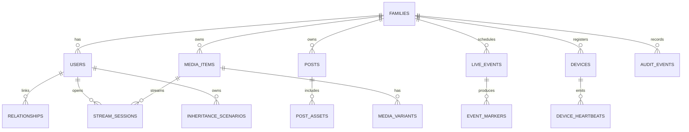

# 34 - Database Schema and ER Diagram

## Objective

Provide one canonical ERD reference for all services and clients.

## ER Diagram (Canonical Draft)

## Table Contract Notes

- All family-scoped tables must include `family_id`.
- Critical mutable entities require `updated_at` and actor attribution.
- Soft-delete policy must be explicit per table.

## Migration Standards

- forward migration and rollback note required
- seed data isolated from schema migration
- avoid irreversible destructive ops without backup checkpoint
