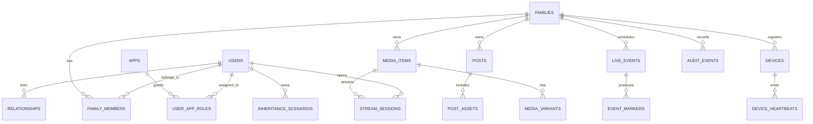

# 34 - Database Schema and ER Diagram

## Objective

Provide one canonical ERD reference for all services and clients.

## ER Diagram (Canonical Draft)

## Table Contract Notes

- All family-scoped tables must include `family_id`.
- Critical mutable entities require `updated_at` and actor attribution.
- Soft-delete policy must be explicit per table.

## Per-App RBAC Model

**Critical Architecture:** Users are NOT family-scoped globally. In monorepo mode, one backend serves multiple apps (ɳFamily, ɳChat, ɳTV) with SSO, but users have **per-app role assignments**.

### Key Tables

- **users**: Global identity (NOT family-scoped)
- **apps**: Registry of apps in the ecosystem (nfamily, nchat, ntv)
- **user_app_roles**: Per-app role assignments (user can be Admin in ɳChat, User in ɳFamily, Viewer in ɳTV)
- **family_members**: Junction table linking users to families (for family-scoped apps)

### Example

User Alice:

- ɳChat: Admin role (full permissions)
- ɳFamily: Regular User role (normal permissions)
- ɳTV: Viewer role (read-only)

This enables one backend to serve multiple apps with granular authorization while maintaining SSO.

See planning documentation for full architecture details.

## Migration Standards

- forward migration and rollback note required
- seed data isolated from schema migration
- avoid irreversible destructive ops without backup checkpoint
